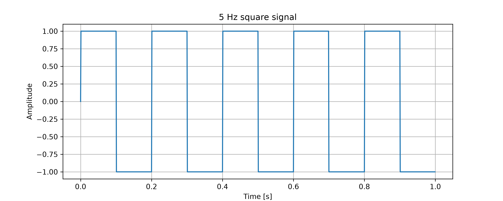
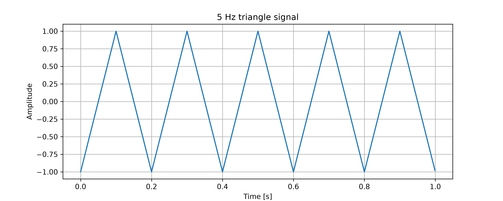
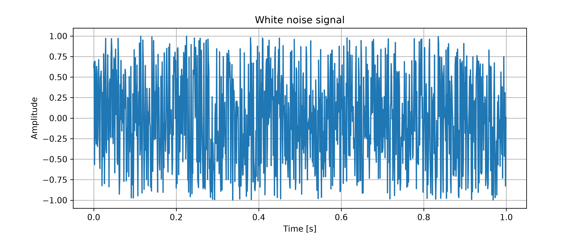

# Audio signal lab

This repository is a personal DSP learning laboratory focused on audio signal processing, signal generation, visualization, and algorithm validation. 

## Current progress

### 01 - Sin Wave Generation 

In this firt experiment, a 5 Hz sin wave was generated using Python, Numpy and Matplotlib

The signal is defined as:

```text
x(t) = A · sin(2πft + φ)
```

# DSP

A simple lab for learning and experimenting with digital signal processing (DSP).

### 02 - Basic Signal Generation

In this experiment, different basic digital signals were generated and visualized using Python, NumPy, SciPy, and Matplotlib.

The generated signals were:

- Square wave
- Triangle wave
- White noise
- Composite signal

## Square wave

A square wave alternates abruptly between high and low amplitude levels.



## Triangle wave

A triangle wave increases and decreases linearly over time.



## White noise

White noise is a random signal with no clear periodic pattern in the time domain.



## Composite signal

The composite signal was created by adding two sine waves:

```text
composite_signal = sine_5hz + sine_20hz
```

### 03 - Reusable Signal Generation Functions

In this experiment, the signal generation code was reorganized into reusable Python functions.

Instead of writing the mathematical formulas directly inside each example script, the main signal generation logic was moved into:

```text
src/signals.py
```

This improves the project structure and makes the code easier to reuse, test, maintain, and extend.

## Implemented functions

The following functions were created:

```text
generate_time_vector()
generate_sine_wave()
generate_square_wave()
generate_triangle_wave()
generate_white_noise()
```

## Why this matters

In digital signal processing projects, it is important to separate the algorithm implementation from the example or application code.

This allows the same DSP functions to be reused in different experiments without duplicating code.

## Generated signals using functions

### Sine wave

A sine wave was generated using the reusable `generate_sine_wave()` function.


### Square wave

A square wave was generated using the reusable `generate_square_wave()` function.


### Triangle wave

A triangle wave was generated using the reusable `generate_triangle_wave()` function.


### White noise

White noise was generated using the reusable `generate_white_noise()` function.


### Composite signal

A composite signal was created by adding two sine waves generated from the reusable function:

```text
composite_wave = sine_5hz + sine_20hz
```

Where:

* `sine_5hz` has amplitude 1.0.
* `sine_20hz` has amplitude 0.5.


## What I learned

* Reusable functions make DSP code cleaner and easier to maintain.
* Signal generation formulas should be separated from plotting and example scripts.
* A signal processing project should have a clear structure.
* Functions allow the same algorithm to be reused with different parameters.
* Modular code is closer to how real engineering projects are organized.
